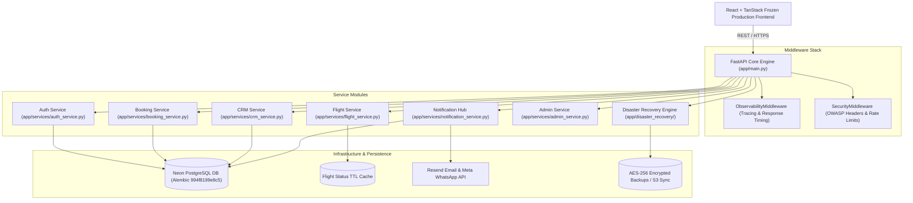

# Enterprise Platform Architecture - Shafsky Aviation

This document details the production backend architecture for the **Shafsky Aviation Concierge Platform**.

---

## 1. High-Level Architecture Overview

---

## 2. Core Principles & Stack Standard

- **Framework**: FastAPI (Python 3.13)
- **Database**: Neon PostgreSQL with SQLAlchemy 2.x ORM & Alembic Migrations
- **Security**: PyJWT with SHA-256 Hashed Refresh Token Rotation, Device Fingerprinting, and 10-tier RBAC Matrix
- **Observability**: Structured JSON Logging, `contextvars`-backed Request Correlation Tracing (`X-Correlation-ID`), Prometheus Metrics Exporter (`/metrics`), Deep Health Engine (`/health`, `/ready`, `/live`)
- **Disaster Recovery**: Neon Point-In-Time Recovery (PITR), AES-256 Encrypted Backups, SHA-256 Checksum Validation, and Graceful Degradation Circuit Breakers
