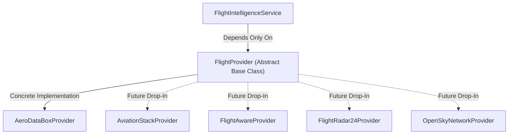

# Enterprise Flight Provider Architecture

## Overview

The **Shafsky Aviation Concierge Backend** implements an extensible, provider-agnostic **Provider Abstraction Architecture** under `app/integrations/aerodatabox/provider.py`.

## Core Design Principles

1. **Zero Vendor Coupling**: Core business logic and FastAPI endpoints depend exclusively on the abstract interface `FlightProvider`.
2. **Normalized Domain Schema**: Vendor-specific payloads are transformed by `FlightDataMapper` into unified Pydantic V2 domain models.
3. **Pluggable Providers**: Changing providers or implementing multi-provider failover requires zero edits to business logic or router code.
4. **Redis Cache Layer**: Provider responses are cached at key paths (`flight:*`, `airport:*`, `airline:*`, `aircraft:*`) with configured TTLs.
